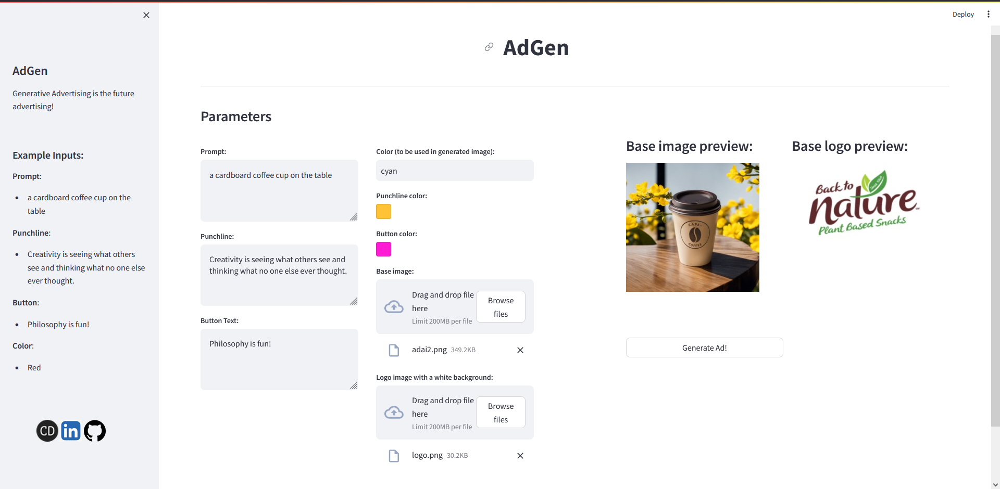
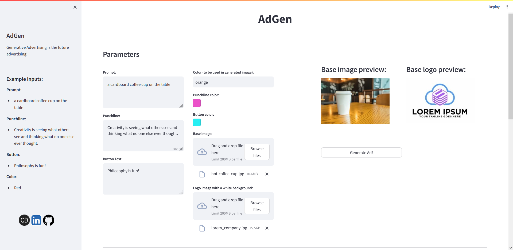

# AdGen
A stable-diffusion ad generation project with a user-interface built with stremamlit and API request model using FastAPI





_This project uses stable-diffusion-webui by AUTO1111_

## Installation
- Clone the project
```
git clone https://github.com/mcandemir/AdGen.git
cd adgen
git clone https://github.com/AUTOMATIC1111/stable-diffusion-webui.git
```

### Model:

> To create realistic ads, I've used RealVis model. You can install it from:
https://civitai.com/models/139562/realvisxl-v20
- Put your installed model under stable-diffusion-webui/models/Stable-diffusion


### Requirements
- Install required libraries to your project environment (a virtual environment is recommended)
```
pip install -r requirements.txt
```

### Add API Commandline Arg
- Add `--api` argument to the `COMMANDLINE_ARGS` in stable-diffusion-webui/user-webui.bat
- Run user-webui.bat

### Run Streamlit User Interface

```
streamlit run app.py --server.port 80
```

### Run FastAPI Microservice
```
uvicorn api:app --reload --port 81
```


